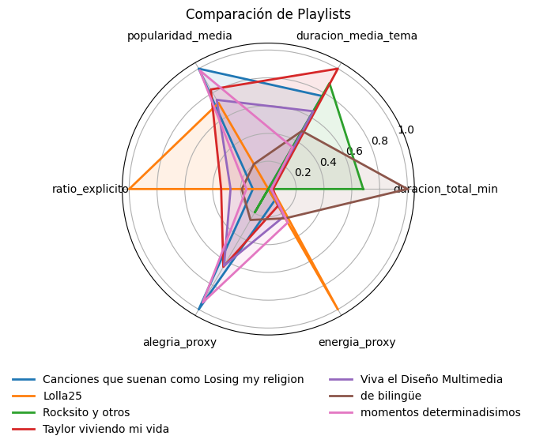

# data-beats

Visualización Inteligente de Playlists y Análisis Descriptivo con Python

Taller dictado en la XXIX Reunión Científica del Grupo Argentino de Bioestadística por Mg. Natalia Rubio, Prof. Sergio Ruminot y Lic. Javier Molina [+info](https://reunion2025.gab.com.ar/wp-content/uploads/2025/06/TALLER-RUBIO-RUMINOT-MOLINA.pdf).

En el taller aprendimos a extraer dataframes a partir de playlist de Spotify usando spotipy. Aquí realicé una pequeña adaptación de los scripts, agregué nuevas funciones y armé un EDA sobre una playlist personal.

---

## How to use

1. Clonar el repo
    ```bash
    git clone https://github.com/vickyguar/data-beats.git
    cd data-beats
    ```

2. Instalar requirements (armar previamente un entorno antes)
    ```bash
    pip install -r requirements.txt
    ```
3. Obtener Credenciales de Spotify
    1. Entrar en [developer.spotify.com](https://developer.spotify.com/)
    2. Iniciar sesión con la cuenta de sopify
    3. Ir al Dashboard y crear una nueva aplicación
    4. Copiar el `Client ID` y `Client Secret`

4. Crear un archivo `.env` en la raíz del proyecto:
    ```env
    SPOTIPY_CLIENT_ID=tu_client_id_aqui
    SPOTIPY_CLIENT_SECRET=tu_client_secret_aqui
    PLAYLIST_ID=id_de_la_playlist
    USER_ID=id_del_usuario
    ```

5. Obtener IDs de Spotify

    PLAYLIST_ID:
    1. Abrir la playlist en Spotify Web
    2. Copiar la URL: `https://open.spotify.com/playlist/[PLAYLIST_ID]`
    3. El `PLAYLIST_ID` es el código después de `/playlist/`

    USER_ID
    1. Abrir el perfil del usuario en Spotify Web
    2. Copiar la URL: `https://open.spotify.com/user/[USER_ID]`
    3. El `USER_ID` es el código después de `/user/`

6. El análisis completo se realiza a través del notebook la notebook [data_beats.ipynb](data_beats.ipynb)

> *la playlist y el usuario deben ser públicos en Spotify.*

## Gráfico de radar

